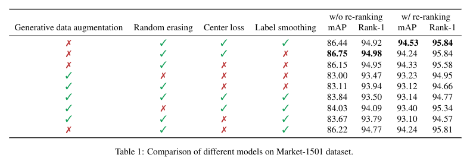

## Improving Personal ReID with Generative Data Augmentation and Various Techniques

In this project, we try to boost the performance of person re-identification (person ReID) task using all kinds of existing techniques.
In [Bag of Tricks and A Strong Baseline for Deep Person Re-identification](https://arxiv.org/abs/1903.07071), Luo et al. apply 
several training tricks on ID Embedding (IDE) network which is a well-known basic baseline in person ReID task including Random Erasing, Warmup Learning Rate, Last Stride, BNNeck.
Similar to what has been done by Luo, we want to explore the effect of these tricks on Multiple Granularities Network ([MGN](https://arxiv.org/pdf/1804.01438v1.pdf)), a state-of-the-art network that 
leverages discriminative information with multiple granularities.  

In addition to training tricks, we also explore the possibilities of using generative model to augment training data that 
can aid the training of person ReID model. We use [DG-Net](https://arxiv.org/abs/1904.07223), a joint learning framework which 
learns generative and discriminative model end-to-end. The author, Zheng el at., claims that the generative model in DG-Net 
is superior than other alternatives such as [PN-GAN](https://arxiv.org/abs/1712.02225), [FD-GAN](https://arxiv.org/abs/1712.02225) and so on. 

#### Results

We can observe that applying data augmentation using generative model will lower the performance, 
which might be the cause of noise in the generated sample. MGN divides input image to various granularities to help discover
 finer discriminative features. When using the image generated by DG-Net, the noise might influence the network more. 

Using Label Smoothing, Center Loss, Random Erasing can help the model learn better. Random Erasing mimic the object occlusion in real-world 
scenario. Center Loss makes up the draw back of triplet loss by learning a center and penalizing the distances between features of each class.
Label Smoothing can help fight against over-fitting the training identifications. This is especially important in the person ReID task because
training identification may not appear in the testing identification.

The best result is when we apply all three training tricks but without data augmentation and with re-ranking. We achieve a small improvement
over the original MGN model and DG-Net model. 

#### Citation
Codes are taken from [GNAYUOHZ / ReID-MGN](https://github.com/GNAYUOHZ/ReID-MGN) and [NVlabs / DG-Net](https://github.com/NVlabs/DG-Net) with some modification. 
Tricks' code including Random Erasing, Label Smoothing and Center Loss are referencing [michuanhaohao / reid-strong-baseline](https://arxiv.org/abs/1904.07223)
[KaiyangZhou / deep-person-reid](https://github.com/KaiyangZhou/deep-person-reid) is also one of the reference we use.

